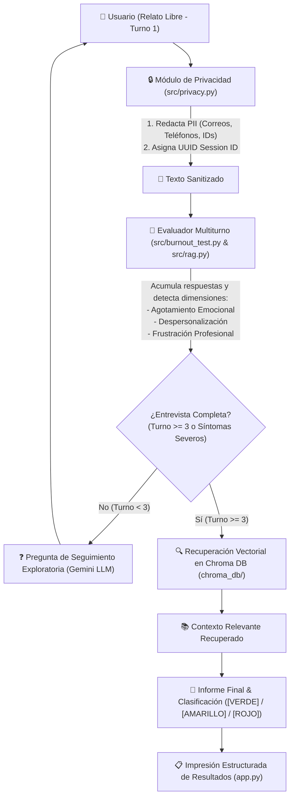

# 🌿 Arquitectura y Funcionamiento del RAG para Detección de Burnout (Sanart)

Este documento explica de forma detallada la arquitectura, componentes, flujo de datos y lógica del sistema de **Generación Aumentada por Recuperación (RAG - Retrieval-Augmented Generation)** desarrollado en **Sanart** para la evaluación conversacional multiturno, clasificación y acompañamiento en la prevención del síndrome de Burnout.

---

## 📐 1. Diagrama General de la Arquitectura Multiturno



---

## 🧩 2. Desglose de Componentes

### 2.1 Módulo de Privacidad (`src/privacy.py`)
* Sanitización de información personal (PII) mediante expresiones regulares.
* Trazabilidad mediante identificadores anónimos de sesión `uuid.uuid4()`.

### 2.2 Entrevista Diagnóstica y Evaluador Multiturno (`src/burnout_test.py`)
* Gestiona la acumulación del diálogo a través de múltiples turnos.
* Identifica progresivamente la presencia de las 3 dimensiones principales del Burnout.
* Genera preguntas exploratorias dirigidas a dimensiones aún no abordadas por el usuario.

### 2.3 Ingesta y Base Vectorial (`src/ingest.py`)
* Procesa documentos guía sobre salud laboral y los fragmenta con `RecursiveCharacterTextSplitter`.
* Genera embeddings de 384 dimensiones con `all-MiniLM-L6-v2` (PyTorch).
* Persiste la base de conocimiento en **Chroma DB** configurada con espacio coseno (`hnsw:space: "cosine"`).

### 2.4 Orquestador RAG Multiturno (`src/rag.py`)
* Mantiene la sesión conversacional (`BurnoutRAGSession`).
* Conecta con **Google Gemini (`gemini-3.5-flash`)** mediante `langchain-google-genai`.
* Alterna dinámicamente entre turnos exploratorios (preguntas de empatía y profundización) e informes diagnósticos finales con recomendaciones fundamentadas en el RAG.

### 2.5 Impresión Final de Resultados (`app.py`)
* Al finalizar los turnos o salir de la sesión, imprime un bloque estructurado con los resultados clave:
  * ID de Sesión Anónimo
  * Conteo de turnos ejecutados
  * Estado de Burnout (`[VERDE]`, `[AMARILLO]`, `[ROJO]`)
  * Lista de dimensiones detectadas
  * Diagnóstico y recomendación principal

---

## 🛠️ 3. Guía de Ejecución

1. **Configurar API Key** en `.env`:
   ```env
   GOOGLE_API_KEY=tu_api_key_aqui
   ```
2. **Ejecutar Ingesta de Conocimiento**:
   ```bash
   python -m src.ingest
   ```
3. **Iniciar Entrevista Multiturno en Consola**:
   ```bash
   python app.py
   ```
